# Home Assistant: Smoke Alarm Display & Automations

06-Feb-25

Safety is so important!

This documentation contains some simple code snippets for using smoke alarms in your house and integrating them into a Home Assistant dashboard. 

## Integrating your smoke alarms

The first step is, of course, buying smart smoke alarms and then integrating them into your smart home system. 

Both Wi Fi and Zigbee based smoke alarms are widely available. As with most smart devices, Zigbee devices typically come at a premium. But their premium can be negated in lower battery consumption, less interference with home WiFi networks and (some heavily restricted Tuya devices discounted) are generally easier to integrate into Home Assistant. Personally, I try to buy Zigbee devices wherever possible. 

## Inspect and note the devices

After integrating the devices to Home Assistant, the next step is to look at the devices and understand which sensors specifically they reveal. 

Typically, smart smoke alarms will reveal three different sensors:

- The all important sensor is the smoke detected state, which is usually presented as a binary sensor. This is the one to use for alarming. 
- Additionally, there is typically also a battery sensor presented, although the manner in which this is offered depends by device. For example, some devices report this as a battery level percentage, while others less healthfully display a binary OK, not OK state. My strong recommendation is to purchase devices which report the battery level as a percentage, as this gives you a chance to monitor the battery level and take proactive steps to ensure that it's never run out. 

These are the entities reported by my bedroom smoke detector. The important ones are the binary sensor and the battery level. In home contexts, and unless you have strong suspicions that your house members are trying to sabotage you, the temper sensor is probably not relevant!

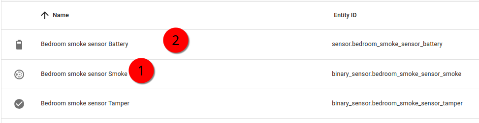

## Creating a group (helper) for the binary sensors

Here's the approach that I take to monitoring the alarms:

- I have a binary sensor group for monitoring all the smoke alarms collectively. I have 4 smoke alarms in my house at the moment. So I don't need to know whether each one is on or off all the time. I just need to be alerted in the rare event that any one of them does go off. 
- I have a home safety dashboard where I monitor all of the alarms individually and also their battery levels. 

For the smoke detection, we're going to create a group for binary sensors

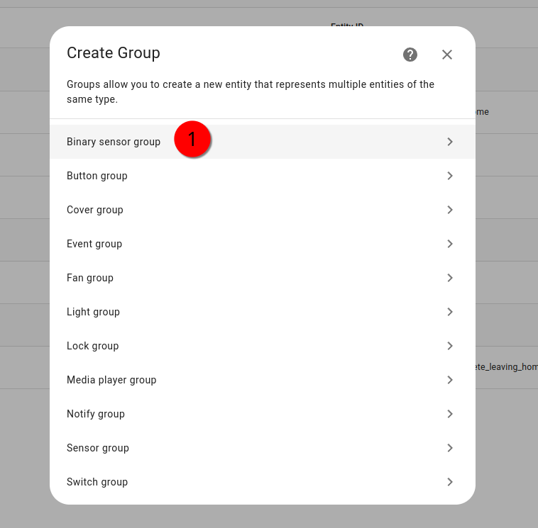

Make sure that you're adding the right sensor for each smoke alarm to the group. The sensor is the smoke sensor. As the tamper sensors might be binary too, you'd want to make sure that you're not adding those. 

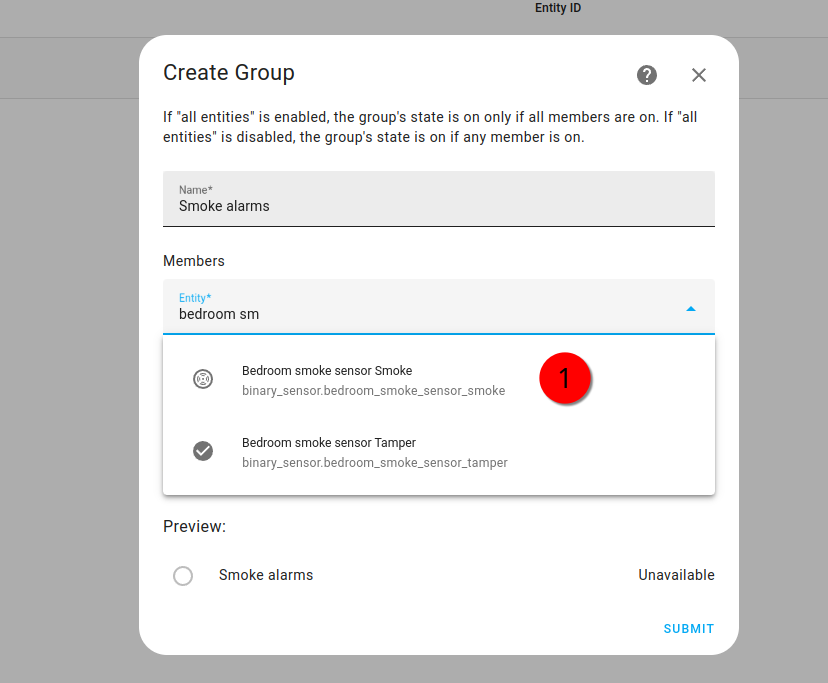

If you have additional home safety sensors, such as a carbon monoxide sensor, you could Add all of these into one broader safety group that encompasses all the binary sensors together. This way you can minimize the amount of things you have to monitor and just get an alarm if any sensor condition is positive. 

The very cool thing about Home Assistant is that you can nest groups within groups. 

In the safety sensor group, for example, I didn't have to manually list each smoke sensor. Rather, I could add that group as its own entity and just add the carbon monoxide sensor on top of it:

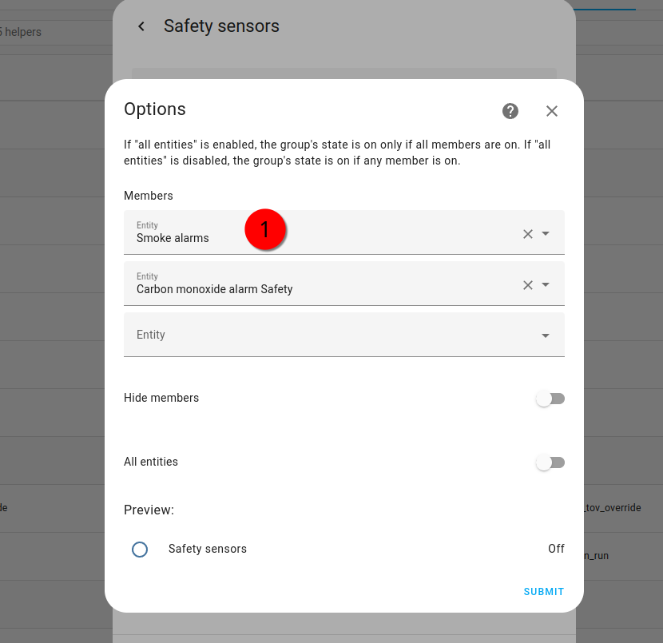

Here's what my smoke alarm group looks like. I've highlighted in red the All entities toggle which I've set to off. This is the default value, and it's important to make sure that that's what you're using. 

In this default configuration, the group will switch to on if anyone smoke alarm is on. In the case of smoke alarms, I would imagine that this is the configuration that essentially all users would like.

## Gather together your sensor IDs

Make a note of all these sensor IDS in your system. 

My "all smoke alarms" binary sensor:

`binary_sensor.smoke_alarms`

And my carbon monoxide sensor:

`binary_sensor.carbon_monoxide_alarm_safety`

## Dashboard Elements For Smoke + CO

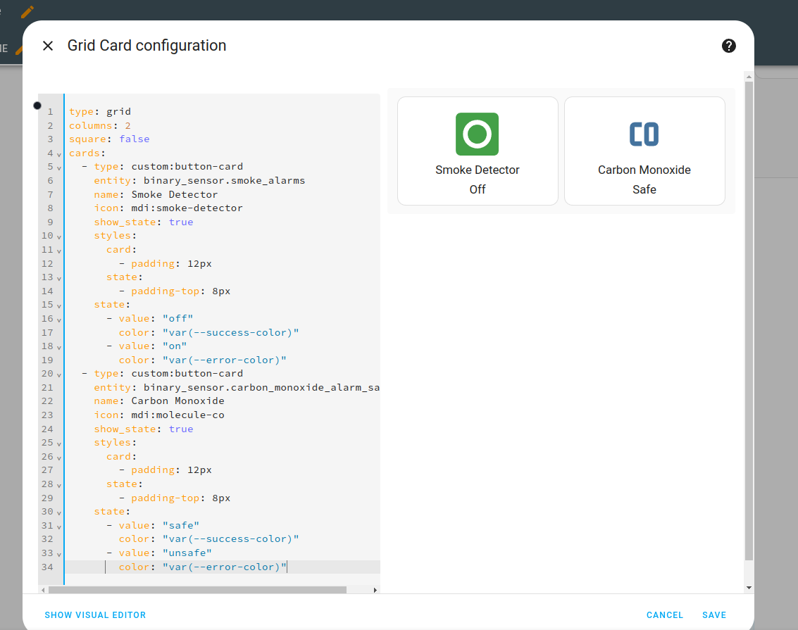

This is a dashboard element showing the alarm state collectively and the carbon monoxide sensor. If you like this element, you would replace with your own entities.

```yaml
type: custom:button-card
entity: binary_sensor.smoke_alarms
name: Smoke Alarms (All)
icon: mdi:smoke-detector
show_state: true
styles:
  card:
    - padding: 12px
  state:
    - padding-top: 8px
state:
  - value: "off"
    color: var(--success-color)
  - value: "on"
    color: var(--error-color)

```

## Quadrant Display For 4 Smoke Alarms With Color-Coding

Widget:

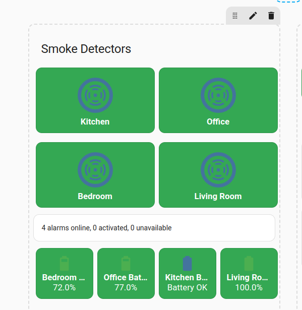

YAML:

```yaml
title: Smoke Detectors
type: vertical-stack
cards:
  - type: grid
    columns: 2
    square: false
    padding: 5
    cards:
      - type: custom:button-card
        entity: binary_sensor.kitchensmokedetector_smoke
        name: Kitchen
        styles:
          card:
            - padding: 12px
            - margin: 5px
          name:
            - font-weight: bold
            - color: white
          state:
            - color: white
        state:
          - value: "on"
            styles:
              card:
                - background-color: "#ea4335"
              name:
                - color: white
              state:
                - color: white
          - value: "off"
            styles:
              card:
                - background-color: "#34a853"
              name:
                - color: white
              state:
                - color: white
          - value: unavailable
            styles:
              card:
                - background-color: "#ffa500"
              name:
                - color: white
              state:
                - color: white
      - type: custom:button-card
        entity: binary_sensor.office_smoke_detector_smoke
        name: Office
        styles:
          card:
            - padding: 12px
            - margin: 5px
          name:
            - font-weight: bold
            - color: white
          state:
            - color: white
        state:
          - value: "on"
            styles:
              card:
                - background-color: "#ea4335"
              name:
                - color: white
              state:
                - color: white
          - value: "off"
            styles:
              card:
                - background-color: "#34a853"
              name:
                - color: white
              state:
                - color: white
          - value: unavailable
            styles:
              card:
                - background-color: "#ffa500"
              name:
                - color: white
              state:
                - color: white
      - type: custom:button-card
        entity: binary_sensor.bedroom_smoke_sensor_smoke
        name: Bedroom
        styles:
          card:
            - padding: 12px
            - margin: 5px
          name:
            - font-weight: bold
            - color: white
          state:
            - color: white
        state:
          - value: "on"
            styles:
              card:
                - background-color: "#ea4335"
              name:
                - color: white
              state:
                - color: white
          - value: "off"
            styles:
              card:
                - background-color: "#34a853"
              name:
                - color: white
              state:
                - color: white
          - value: unavailable
            styles:
              card:
                - background-color: "#ffa500"
              name:
                - color: white
              state:
                - color: white
      - type: custom:button-card
        entity: binary_sensor.living_room_smoke_detector_smoke
        name: Living Room
        styles:
          card:
            - padding: 12px
            - margin: 5px
          name:
            - font-weight: bold
            - color: white
          state:
            - color: white
        state:
          - value: "on"
            styles:
              card:
                - background-color: "#ea4335"
              name:
                - color: white
              state:
                - color: white
          - value: "off"
            styles:
              card:
                - background-color: "#34a853"
              name:
                - color: white
              state:
                - color: white
          - value: unavailable
            styles:
              card:
                - background-color: "#ffa500"
              name:
                - color: white
              state:
                - color: white
  - type: markdown
    style: |
      ha-card {
        padding: 16px;
        margin-top: 16px;
      }
    content: >
         
      
        
          
        
          
        
        {{ online }}
      alarms online, {{ active.count }} activated, {{ unavailable.count }}
      unavailable
```

## Aggregating Battery Statuses Into One Reporting Entity

As mentioned earlier, different smoke sensors report their battery states in different ways. Just as with the smoke alarm sensing, we might want to try to reduce this to one sensor for convenience. 

You can add a template like this into your configuration to achieve this

```
template:
  - binary_sensor:
      name: "Smoke Detector Batteries Status"
      state: >
        
        
        
        
        {{ 
          bedroom <= 10 or 
          office <= 10 or 
          living_room <= 10 or 
          kitchen == 'on'
        }}
      device_class: battery
```
## Battery level row with conditional styling for alerts

This card lists the battery levels for the sensors and will only show red if any are below 10% or it's a negative binary state. 

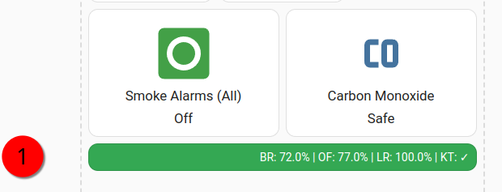

```yaml
type: custom:button-card
show_name: false
show_icon: false
show_state: false
custom_fields:
  battery: >
    [[[
      const bedroom = states['sensor.bedroom_smoke_sensor_battery'].state;
      const office = states['sensor.office_smoke_detector_battery'].state;
      const living = states['sensor.living_room_smoke_detector_battery'].state;
      const kitchen = states['binary_sensor.kitchensmokedetector_battery_low'].state;
      
      const kitchenStatus = kitchen === 'off' ? '✓' : '⚠';
      
      return `BR: ${bedroom}% | OF: ${office}% | LR: ${living}% | KT: ${kitchenStatus}`;
    ]]]
styles:
  card:
    - padding: 8px
  custom_fields:
    battery:
      - font-size: 14px
      - text-align: center
      - color: white
state:
  - operator: template
    value: >
      [[[ 
        const bedroom = Number(states['sensor.bedroom_smoke_sensor_battery'].state);
        const office = Number(states['sensor.office_smoke_detector_battery'].state);
        const living = Number(states['sensor.living_room_smoke_detector_battery'].state);
        const kitchen = states['binary_sensor.kitchensmokedetector_battery_low'].state;
        
        return bedroom <= 10 || office <= 10 || living <= 10 || kitchen === 'on';
      ]]]
    styles:
      card:
        - background-color: "#ea4335"  # Red
  - operator: default
    styles:
      card:
        - background-color: "#34a853"  # Green
```

## Driving automations/alarming

Finally, we get to the question of what to do about alarming. Clearly this is actually the most important part of setting up smoke alarms!

I'm using the helper grouping again in order to simplify the process of setting up an automation. I'm departing from the principle that if any smoke alarm is positive or the carbon monoxide sensor, I'll want to know about it anywhere in the house immediately. So my automation will be triggered based upon a true state on the group sensor. 

You can use YAML or the Visual builder to create an automation like this.

**Trigger**:

If the state of my binary sensor safety group turns to ON, which would happen if any constituent sensor were to become on:


**Action:**

Alarming.

Then my warning sirens (another entity group) will toggle to on:

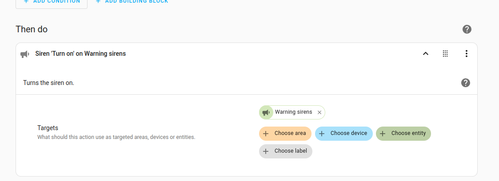

You probably also want to add additional alarming to take advantage of the fact that unlike a conventional fire alarm, smart fire alarms can notify you wherever you are. 

If you are at home when a smoke alarm triggers, it's pretty obvious that you're going to be alerted to the alarm by the alarms in your house if you have them, the physical alarm on the device, or other factors.


But you might wish to configure push emergency notifcations on all your connected devices that will send through a designated emergency alerting channel in the event that this state becomes positive.

## Low battery warnings

Finally, let's add a bit of notifications to the battery level monitoring, seeing as we have it as an option.

If you have smoke alarms that are all of the same type and report their sensor type consistently, then it's easier to do this. This is a great reason, in fact, to buy your smoke alarms in a batch - You'll know that they have the exact same functionality and sensors (I just wish I had thought of this beforehand!)

Let's create a sensor group for the battery levels:

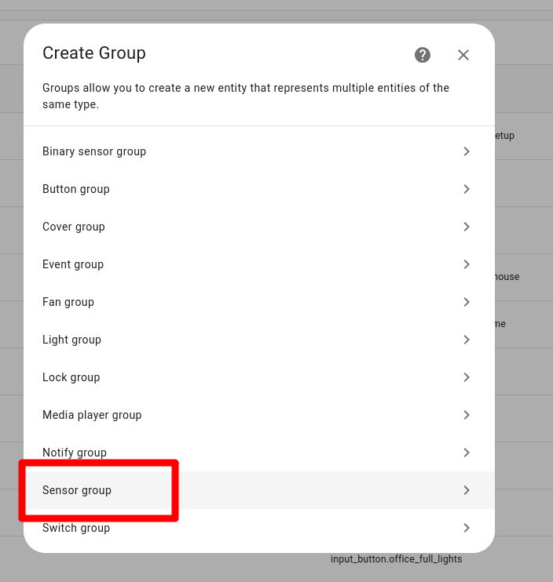

I'll call this one "smoke alarm battery levels":

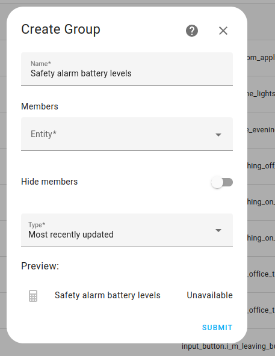

You could use the minimum value as the "type":

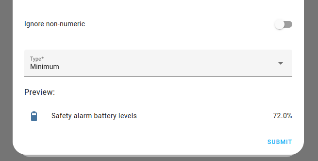

## Low battery notifications

```yaml
alias: "Low Battery Alert - Safety Devices"
description: "Notify when smoke or CO detector batteries are low"
trigger:
  # Numeric sensors
  - platform: numeric_state
    entity_id:
      - sensor.bedroom_smoke_sensor_battery
      - sensor.office_smoke_detector_battery
      - sensor.living_room_smoke_detector_battery
      - sensor.carbon_monoxide_alarm_battery
    below: 10
  # Binary sensor for kitchen (special case)
  - platform: state
    entity_id: binary_sensor.kitchensmokedetector_battery_low
    to: "on"

condition:
  # Avoid notification spam by checking if the battery is not "unknown" or "unavailable"
  - condition: template
    value_template: >-
      {{ not is_state(trigger.entity_id, 'unknown') and 
         not is_state(trigger.entity_id, 'unavailable') }}

action:
  - service: persistent_notification.create
    data:
      title: "⚠️ Low Battery Alert"
      message: >-
        {{ trigger.to_state.attributes.friendly_name }} is at 
        
        a low level
        
        {{ trigger.to_state.state }}%
        
        and needs attention!
  
  - service: notify.mobile_app_your_phone_name  # Replace with your actual mobile app notify service
    data:
      title: "⚠️ Low Battery Alert"
      message: >-
        {{ trigger.to_state.attributes.friendly_name }} is at 
        
        a low level
        
        {{ trigger.to_state.state }}%
        
        and needs attention!
      data:
        priority: high
        channel: Safety  # Optional: Create a specific notification channel for safety alerts

  # Optional: Repeat notification every 24 hours until fixed
  - service: script.turn_on
    target:
      entity_id: script.battery_reminder
```

## Use Case Statement

## Author

Daniel Rosehill  
(public at danielrosehill dot com)

## Licensing

This repository is licensed under CC-BY-4.0 (Attribution 4.0 International) 
[License](https://creativecommons.org/licenses/by/4.0/)

### Summary of the License
The Creative Commons Attribution 4.0 International (CC BY 4.0) license allows others to:
- **Share**: Copy and redistribute the material in any medium or format.
- **Adapt**: Remix, transform, and build upon the material for any purpose, even commercially.

The licensor cannot revoke these freedoms as long as you follow the license terms.

#### License Terms
- **Attribution**: You must give appropriate credit, provide a link to the license, and indicate if changes were made. You may do so in any reasonable manner, but not in any way that suggests the licensor endorses you or your use.
- **No additional restrictions**: You may not apply legal terms or technological measures that legally restrict others from doing anything the license permits.

For the full legal code, please visit the [Creative Commons website](https://creativecommons.org/licenses/by/4.0/legalcode).
