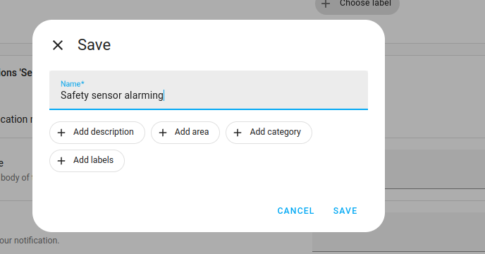

# Home Assistant: Smoke Alarm Display & Automations

06-Feb-25

Safety is important!

This documentation contains code snippets for integrating smoke alarms into a Home Assistant dashboard and creating related automations.

## Integrating Your Smoke Alarms

The first step is buying smart smoke alarms and integrating them into your smart home system.

Both Wi-Fi and Zigbee-based smoke alarms are widely available. Zigbee devices typically cost more. However, the benefits can include lower battery consumption, less interference with home Wi-Fi networks, and easier integration into Home Assistant (especially for some heavily restricted Tuya devices). I recommend buying Zigbee devices whenever possible.

## Inspect and Note the Devices

After integrating the devices into Home Assistant, identify the specific sensors they expose.

Typically, smart smoke alarms will expose three different sensors:

- The most important sensor is the smoke detected state, usually presented as a binary sensor. Use this for alarming.
- Additionally, there is typically a battery sensor. Some devices report this as a battery level percentage, while others display a binary "OK" or "not OK" state. I strongly recommend purchasing devices that report the battery level as a percentage. This allows you to monitor the battery level and take proactive steps to replace batteries before they run out.

These are the entities reported by my bedroom smoke detector. The important ones are the binary sensor and the battery level. Unless you have strong suspicions that someone is sabotaging your house, the tamper sensor is probably not relevant!

## Creating a Group (Helper) for the Binary Sensors

Here's my approach to monitoring the alarms:

- I use a binary sensor group to monitor all smoke alarms collectively. I have four smoke alarms in my house. I don't need to know whether each one is on or off all the time. I just need to be alerted if any one of them goes off.
- I have a home safety dashboard where I monitor all the alarms individually and their battery levels.

For smoke detection, we're going to create a group for binary sensors.

Make sure that you're adding the correct sensor for each smoke alarm to the group. Add the smoke sensor, not the tamper sensors (as they might also be binary).

If you have additional home safety sensors, such as a carbon monoxide sensor, you could add all of these into one broader safety group. This way, you can minimize the number of things you have to monitor and just get an alarm if any sensor condition is positive.

Home Assistant allows you to nest groups within groups.

In the safety sensor group, I didn't have to manually list each smoke sensor. Instead, I added the smoke sensor group as its own entity and added the carbon monoxide sensor on top of it:

Here's what my smoke alarm group looks like. I've highlighted in red the "All entities" toggle, which I've set to "off". This is the default value, and it's important to ensure that's what you're using.

In this default configuration, the group will switch to "on" if any smoke alarm is "on". I imagine that essentially all users would prefer this configuration.

## Gather Together Your Sensor IDs

Make a note of all these sensor IDs in your system.

My "all smoke alarms" binary sensor:

`binary_sensor.smoke_alarms`

And my carbon monoxide sensor:

`binary_sensor.carbon_monoxide_alarm_safety`

## Dashboard Elements For Smoke + CO

This is a dashboard element showing the alarm state collectively and the carbon monoxide sensor. Replace the entities with your own.

[Dashboard Element Code](code_samples/dashboard_element.yaml)

## Quadrant Display For 4 Smoke Alarms With Color-Coding

Widget:

YAML:

[Quadrant Display Code](code_samples/quadrant_display.yaml)

## Aggregating Battery Statuses Into One Reporting Entity

As mentioned earlier, different smoke sensors report their battery states in different ways. Just as with the smoke alarm sensing, we might want to try to reduce this to one sensor for convenience.

You can add a template like this into your configuration to achieve this

[Battery Status Template Code](code_samples/battery_status_template.yaml)

## Battery level row with conditional styling for alerts

This card lists the battery levels for the sensors and will only show red if any are below 10% or it's a negative binary state.

[Battery Level Card Code](code_samples/battery_level_card.yaml)

## Driving Automations/Alarming

Finally, we get to the question of what to do about alarming. Clearly this is actually the most important part of setting up smoke alarms!

I'm using the helper grouping again in order to simplify the process of setting up an automation. I'm departing from the principle that if any smoke alarm is positive or the carbon monoxide sensor, I'll want to know about it anywhere in the house immediately. So my automation will be triggered based upon a true state on the group sensor.

You can use YAML or the Visual builder to create an automation like this.

**Trigger**:

If the state of my binary sensor safety group turns to ON, which would happen if any constituent sensor were to become on:

**Action:**

Alarming.

Then my warning sirens (another entity group) will toggle to on:

You probably also want to add additional alarming to take advantage of the fact that unlike a conventional fire alarm, smart fire alarms can notify you wherever you are.

If you are at home when a smoke alarm triggers, it's pretty obvious that you're going to be alerted to the alarm by the alarms in your house if you have them, the physical alarm on the device, or other factors.

But you might wish to configure push emergency notifications on all your connected devices that will send through a designated emergency alerting channel in the event that this state becomes positive.

## Low Battery Warnings

Finally, let's add a bit of notifications to the battery level monitoring, seeing as we have it as an option.

If you have smoke alarms that are all of the same type and report their sensor type consistently, then it's easier to do this. This is a great reason, in fact, to buy your smoke alarms in a batch - You'll know that they have the exact same functionality and sensors (I just wish I had thought of this beforehand!)

Let's create a sensor group for the battery levels:

I'll call this one "smoke alarm battery levels":

You could use the minimum value as the "type":

## Low Battery Notifications

[Low Battery Notification Code](code_samples/low_battery_notification.yaml)

## Use Case Statement

## Author

Daniel Rosehill  
(public at danielrosehill dot com)

## Licensing

This repository is licensed under CC-BY-4.0 (Attribution 4.0 International) 
[License](https://creativecommons.org/licenses/by/4.0/)

### Summary of the License
The Creative Commons Attribution 4.0 International (CC BY 4.0) license allows others to:
- **Share**: Copy and redistribute the material in any medium or format.
- **Adapt**: Remix, transform, and build upon the material for any purpose, even commercially.

The licensor cannot revoke these freedoms as long as you follow the license terms.

#### License Terms
- **Attribution**: You must give appropriate credit, provide a link to the license, and indicate if changes were made. You may do so in any reasonable manner, but not in any way that suggests the licensor endorses you or your use.
- **No additional restrictions**: You may not apply legal terms or technological measures that legally restrict others from doing anything the license permits.

For the full legal code, please visit the [Creative Commons website](https://creativecommons.org/licenses/by/4.0/legalcode).
